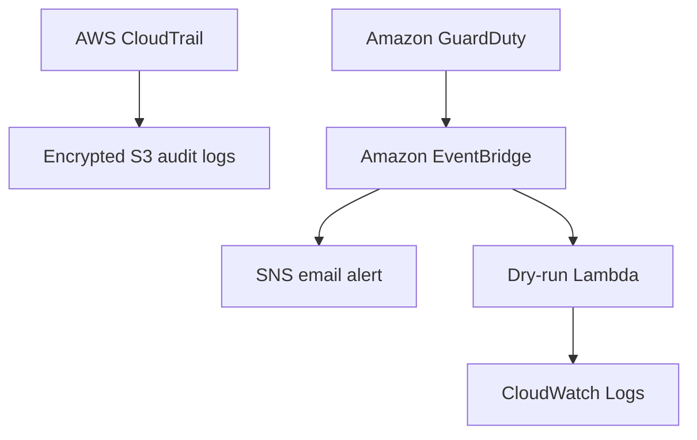

# AWS Threat Detection and Automated Response

## Project Overview

This project demonstrates an AWS security-monitoring and automated incident-response environment built with Terraform and Python.

The environment will collect audit activity, detect suspicious behavior, centralize security findings, route selected events, and initiate controlled response workflows.

> **Project status:** In development. Features will be marked complete only after deployment and validation.

## Business Problem

Manually reviewing and responding to cloud-security findings can delay containment and create inconsistent remediation. This project demonstrates how AWS-native services can improve visibility, detection, alerting, and repeatable incident response.

## Implemented Architecture

## Implemented Security Controls

- Multi-Region AWS CloudTrail audit logging
- Private, versioned, and encrypted S3 log storage
- S3 public-access blocking and secure-transport enforcement
- Customer-managed KMS encryption with automatic rotation for CloudTrail, S3, and SNS
- Amazon GuardDuty threat detection with cost-controlled protection plans
- EventBridge routing for findings with severity `>= 4`
- Confirmed SNS email security notifications
- Least-privilege Lambda execution role
- Python-based response decision engine
- Mandatory `DRY_RUN` response guardrail
- CloudWatch response logging and audit evidence
- Terraform-managed infrastructure
- Automated Lambda tests, Terraform validation, and blocking Trivy security scanning in GitHub Actions
- No permanent AWS credentials stored in GitHub

## Roadmap

- Add AWS Security Hub findings aggregation
- Add AWS Config monitoring
- Add controlled and reversible EC2 isolation
- Add GitHub Actions OIDC for authorized AWS workflows

## Repository Structure

| Path | Purpose |
|---|---|
| `.github/workflows/` | GitHub Actions CI workflows |
| `diagrams/` | Architecture diagram assets |
| `docs/` | Implementation, deployment, and testing evidence |
| `lambda/` | Python automated-response handlers |
| `terraform/` | AWS infrastructure as code |
| `tests/` | Automated Lambda unit tests |
| `.gitignore` | Excludes state, plans, credentials, and generated files |
| `README.md` | Project overview and architecture |
| `SECURITY.md` | Secure-use and disclosure guidance |

## Learning Objectives

1. Provision AWS security services with Terraform.

2. Apply least-privilege IAM permissions.

3. Centralize AWS security findings.

4. Build event-driven security automation.

5. Test detection and response workflows safely.

6. Document technical decisions and evidence.

7. Integrate security checks into CI/CD.

## Prerequisites

- AWS account

- AWS CLI

- Terraform

- Git and GitHub

- PowerShell or another terminal

## Cost and Cleanup

This project was temporarily deployed in AWS for controlled validation and then destroyed using Terraform to prevent ongoing charges. Recreating the environment may incur AWS costs. Always review the Terraform destroy plan carefully after testing.

## Author

**Hilary Mbamoh Pemamboh**

Cloud Security Engineer

Dallas, Texas
